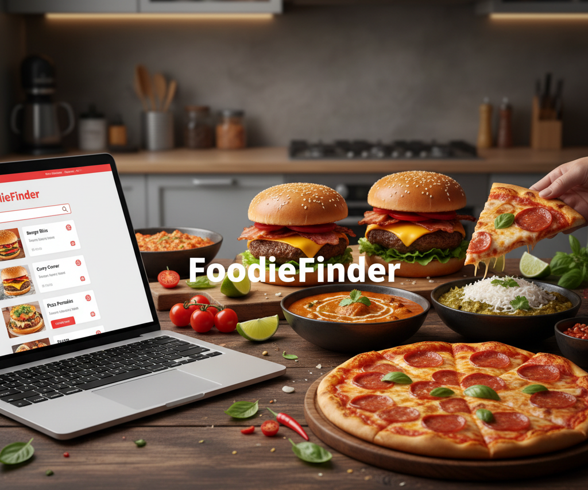

# 🍔 FoodieFinder - MERN Stack Restaurant Application

FoodieFinder is a full-stack restaurant discovery and food ordering web application inspired by Zomato and Swiggy. Built with the MERN stack (MongoDB, Express, React, Node.js) and TypeScript, it features robust search, filtering, authentication, and a dynamic shopping cart system.




---

## 🚀 Features

### 🎨 Frontend
- **Modern UI:** Built with React, Vite, and Tailwind CSS.
- **Advanced Filtering:** Filter by cuisine, rating, and price range sliders.
- **Search & Sort:** Real-time search by restaurant name or cuisine; sort by relevance, cost, or delivery time.
- **Restaurant Details:** View restaurant info, ratings, and dynamic menu lists.
- **Shopping Cart:** Add/remove items, calculation of totals, and restaurant conflict warnings (Context API).
- **Authentication:** User Login and Signup pages with JWT handling.
- **Responsive:** Fully optimized for Mobile, Tablet, and Desktop.

### 🏗️ Backend
- **RESTful API:** Built with Node.js, Express, and TypeScript.
- **Database:** MongoDB with Mongoose schemas (Relationships between Restaurants and MenuItems).
- **Authentication:** Secure JWT-based authentication (Signup/Login).
- **Pagination:** Server-side pagination for optimized performance.
- **Seeding Script:** Automated script to populate the database with dummy data.

---


## 🛠️ Tech Stack

| Component | Technology |
|-----------|------------|
| **Frontend** | React (Vite), TypeScript, Tailwind CSS, React Query (TanStack), Axios, Lucide Icons |
| **Backend** | Node.js, Express.js, TypeScript |
| **Database** | MongoDB, Mongoose |
| **Auth** | JSON Web Token (JWT), Bcryptjs |

---

## ⚙️ Installation & Setup

Follow these steps to get the project running locally.

### Prerequisites
- Node.js (v16+)
- MongoDB (Local or Atlas URI)

### 1. Clone the Repository
```bash
git clone https://github.com/yourusername/foodiefinder.git
cd foodiefinder

```

### 2.  Backend Setup
Navigate to the backend folder and install dependencies.

```
cd backend
npm install
```
#### Environment Variables:
Create a .env file in the backend root folder:

#### Seed Database:
Populate the database with initial restaurant and menu data.
```
npm run seed
```

#### Start Backend Server:
```
npm run dev
```
Server will start on http://localhost:5000

### 3. Frontend Setup
Open a new terminal, navigate to the frontend folder, and install dependencies.

```
cd frontend
npm install
```
#### Start Frontend Server:
```
npm run dev

```

App will run on http://localhost:5173

## 📂 Project Structure

```
FoodieFinder/
├── backend/
│   ├── src/
│   │   ├── config/         # DB Connection
│   │   ├── controllers/    # Logic for Restaurants & Users
│   │   ├── middleware/     # Auth Middleware
│   │   ├── models/         # Mongoose Schemas (User, Restaurant, MenuItem)
│   │   ├── routes/         # API Routes
│   │   └── scripts/        # Seed data script
│   └── .env
├── frontend/
│   ├── src/
│   │   ├── api/            # Axios client setup
│   │   ├── components/     # Reusable components (Navbar, CartDrawer, Cards)
│   │   ├── context/        # AuthContext and CartContext
│   │   ├── pages/          # Home, Login, Details pages
│   │   └── App.tsx
│   └── tailwind.config.js
```
## 🔌 API Endpoints
```
Restaurants
Method	                 Endpoint	             Description
GET	                     /api/restaurants	     Fetch all restaurants with filters & pagination
GET	                     /api/restaurants/:id    Get details and menu of a specific restaurant


Users (Auth)
Method	                 Endpoint	             Description
POST	                 /api/users/signup	     Register a new user
POST	                 /api/users/login	     Login and receive JWT
```


